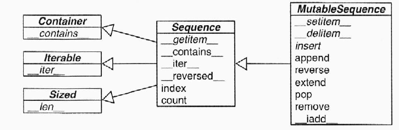
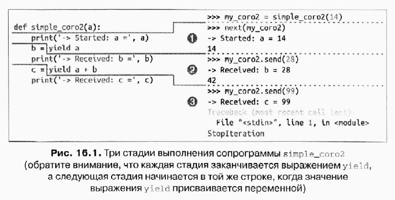
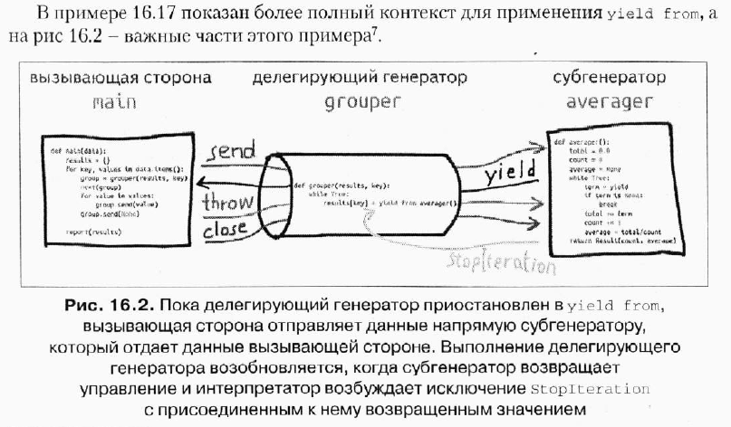
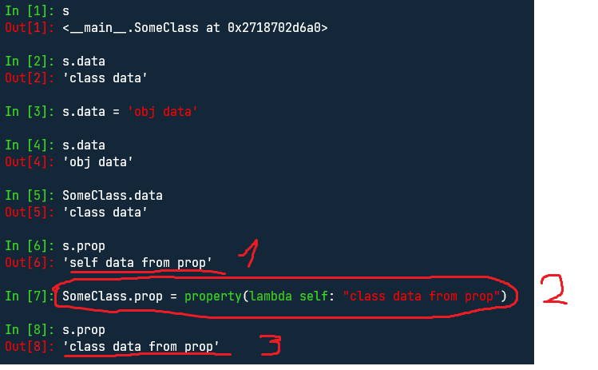

# Конспект по книге "К вершинам мастерства"

> _не с самого начала, а с главы "Декораторы функций и замыкания", стр 226_

## Декоратор функций и замыкания

### Замыкания

**Замыкание** - функция, с расширенной областью видимости, которая охватывает в себе _неглобальные переменные_, которыые есть в теле функции, они в нем не определены.

```python
def make_averager():
  series = []
  def averager(value):
    series.append(value)
    return sum(series) / len(series)
  return averager

avg = make_averager()
print(avg(1))  # 1.0
print(avg(2))  # 1.5
print(avg(3))  # 2.0
```

В данном случаe **_averager_** является замыканием и замыкает **_series_**.
Эта функция не эффиктивна, зачем нам хранить массив, если мы можем хранить сумму и количество элементов.

```python
def make_averager():
  summ = 0
  total = 0
  def averager(value):
    # без nonlocal будет ошибка
    nonlocal summ, total
    summ += value
    total += 1
    return summ / total
  return averager

avg = make_averager()
print(avg(1))  # 1.0
print(avg(2))  # 1.5
print(avg(3))  # 2.0
```

Почему без nonlocal ничего работать не будет?
Потому что **_summ_** и **_total_** - _изменяемые типы данных_, это означает, что мы в теле _averager_ мы неявно создаем локальные переменные, которые уже не являются свободными и потому не запоминается в замыкании.

### Functool.wraps

```python
def decofunc(func):
  '''
  декоратор, который просто возвращает результат функции + !!!
  '''
  def inner_func(*args, **kwargs):
    return f'{func(*args, **kwargs)}!!!'
  return inner_func


@decofunc
def func1():
  '''
  its first func, that return 10
  '''
  return 10

@decofunc
def func2():
  '''
  its second func, that return 20
  '''
  return 20
```

Что мы ожидаем увидеть от **\_func1.**name**\_** или **\_func1.**doc**\_** - _func1_ и _its first func, that return 10_ соответсвенно, но увидем:

```python
print(func1.__name__)  # inner_func
print(func1.__doc__)   # None
```

Что логично, и как это решать?

```python
def decofunc(func):
  '''
  декоратор, который просто возвращает результат функции + !!!
  '''
  def inner_func(*args, **kwargs):
    return f'{func(*args, **kwargs)}!!!'
  inner_func.__name__ = func.__name__
  inner_func.__doc__ = func.__doc__
  return inner_func


print(func1.__name__)  # func1
print(func1.__doc__)   # its first func, that return 10
```

Или просто воспользоваться декоратором **_functools.wraps_**, которые делает тоже самое:

```python
import functools

def decofunc(func):
  '''
  декоратор, который просто возвращает результат функции + !!!
  '''
  @functools.wraps(func)
  def inner_func(*args, **kwargs):
    return f'{func(*args, **kwargs)}!!!'
  return inner_func

print(func1.__name__)  # func1
print(func1.__doc__)   # its first func, that return 10
```

### Functools.lru_cache

Иногда функции могут работать безумно долго, и в таком случае для одного и того же набора аргументов просто расточительно выполнять функцию больше одного раза - выполнил одни раз и закешировал в словаре для таких-то аргументов такой ответ, если значение в словаре уже есть, то просто берем результат оттуда, а не запускаем функцию заново

```python
from time import sleep


def cache_decorator(func):
  '''
  кеширующий декоратор
  '''
  cache = {}
  def inner(*args):
    args_as_string = str(args)
    if args_as_string in cache:
      return cache[args_as_string]
    func_result = func(*args)
    cache[args_as_string] = func_result
  return inner


@cache_decorator
def very_hard_func(a, b):
  '''
  функуция, которая очень долго работает
  '''
  print('we are in func')
  sleep(1)
  return a * b


very_hard_func(10, 20)  # we are in func
very_hard_func(10, 20)  # здесь принта не будет, т.к. мы не зашли в функцию
```

Все тоже самое делает и **_functools.lru_cache()_**

```python
import functools
from time import sleep


@functools.lru_cache()
def very_hard_func(a, b):
  '''
  функуция, которая очень долго работает
  '''
  print('we are in func')
  sleep(1)
  return a * b


very_hard_func(10, 20)  # we are in func
very_hard_func(10, 20)  # здесь принта не будет, т.к. мы не зашли в функцию
```

### Functools.singledispatch

Допустим у нас есть какая-то фукнция из другой библиотеки, и мы хотели, чтобы в общем случае она работала так, но например если **_type(a)_** результат был бы другим.

```python
def some_internal_func(a):
  '''
  Допустим это функция из другой какой то библиотеки
  '''
  return f'<type>{type(a)}</type>'
```

Нет механизма перегрузки функций, но мы бы например могли написать свою с дополнительными условием:

```python
def some_internal_func(a):
  '''
  Допустим это функция из другой какой то библиотеки
  '''
  return f'<type>{type(a)}</type>'


def override_some_internal_func(a):
  '''
  перегрузка функции some_internal_func
  '''
  if type(a) == str:
    return f'<str>{type(a)}</str>'
  return some_internal_func(a)


print(override_some_internal_func(1))  # '<type>int</type>'
print(override_some_internal_func('some string'))  # '<str>int</str>'
```

Но можно воспользоваться декоратом **_functools.singledispatch_**

```python
import functools


def some_internal_func(a):
  '''
  Допустим это функция из другой какой то библиотеки
  '''
  return f'<type>{type(a)}</type>'

some_internal_func = functools.singledispatch(some_internal_func)

@some_internal_func.register(str)
def _(a):
  '''
  это по сути тот же if, только более элегантный
  если мы будем вызываеть some_internal_func(a) и аргумент a будет типом str,
  то мы будет попадать в эту функцию
  '''
  return f'<str>{type(a)}</str>'


print(some_internal_func(1))  # '<type>int</type>'
print(some_internal_func('some string'))  # '<str>str</str>'
```

### Декоратор и аргументами

```python
registry = set()


def register(is_active: bool = True):
  '''
  декоратор с аргументом: заносит принимаюмею функции в множестве или удаляет ее оттуда взависимости от is_active
  '''
  def decorator(func):
    if is_active:
      registry.add(func)
    else:
      registry.discard(func)
    return func

  return decorator


@register(is_active=True)   # аналог register()(func1)
def func1():
  pass


@register(is_active=False)
def func2():
  pass


print(registry)  # (func1, )
```

> locals() - позволяет получить все переменные в локальной области
> print('{a}: {b}'.format(\*\*locals()))

## Ссылки на объекта, изменяемость и повторное использование

> Переменные не являются ящиками, а лишь этикетками.

Пример:

```python
# это невозможон объяснить в при помощи теории ящиков, две этикетки навешка на один объект
a = [1, 2, 3]
b = a
a.append(4)
print(b)  # [1, 2, 3, 4]
```

> по умолчанию копирование поверхностное

```python
a = [[1, 2], 4]
# в этот момент создается поверхностная копия ( тут не было бы проблем, если бы все элементы были не изменяемы )
b = a[:]
print(a is b)  # False
print(a == b)  # True
a[0].append(3)
print(b)  # [[1, 2, 3], 4]
# a и b - разные объекты, но изменяемые элементы внутри них одни и те же объекты
print(a[0] is b[0])  # True
```

> deepcopy

```python
from copy import deepcopy

a = [[1, 2,], 4]
b = deepcopy(a)
a[0].append(3)
print(b)  # [[1, 2], 4]
print(a[0] is b[0])  # False
```

> вызов по использованию означает, что каждый параметр функции получает копию сылки на фактический аргумент.
> это означает, что аргумент функции и переменная извне является _синонамимами_

```python
def func(a, b):
  a += b
  return


a, b = [10], [20]  # изменяемый тип данных
a1, b1, = 10, 20  # неизменяемые тип данных

func(a, b)
print(a)  # [10, 20]  - "a" извне изменился, т.к. функция в качестве аргумента принимает его синоним

func(a1, b1)
print(a1)  # 10 - "a" извне не изменился, функция в качестве аргумента принила его синоним,
#  но т.к. это неизменяемый тип данных, то внутри функции создался новый объект, на который теперь ссылается "а"
```

> значение по умолчанию изменяемого типа - неудачная мысль

```python
class Person:

  def __init__(self, name):
    self.name = name

  def __repr__(self):
    return f'<Person: {self.name}'

class ClassRoom:

  def __init__(self, persons=[]):
    self.persons = persons

  def append(self, new_person):
    self.persons.append(new_person)

  def pop(self):
    self.persons.pop()

  def __repr__(self):
    return str(f'Cr: <{[p.name for p in self.persons]}>')
```

```python
p1 = Person('p1')
p2 = Person('p2')
p3 = Person('p3')

cr = ClassRoom()
cr.append(p1)
cr.append(p2)
print(cr)   # Cr: <['p1', 'p2']>

new_cr = ClassRoom()
print(new_cr)  # Cr: <['p1', 'p2']> - хотя мы никого не заносили в new_cr
```

**Почему это произошло?**

1. Значение по умолчанию это список (изменяемый тип), в **_init_**, мы присваиваем в **_self.persons=persons_**
   Сколько тут объектов, а сколько переменных?
   1 объект, 2 переменные указывающие на один и тот же объект.
2. Так как мы выяснили, что _self.persons_ и аргумент _persons_ указывает на один и тот же объект, то в методе _append_ мы добавляем элемент **и туда и туда**!
3. Из-за (1) и (2) при создании нового _ClassRoom_ значение по умолчанию _persons_ уже не равно пустому списку.
   Мы можем посмотреть, что лежит в значениях по умолчанию в _**init**_

```python
print(ClassRoom.__init__.__defaults__)  # ([], )

p1 = Person('p1')
p2 = Person('p2')
p3 = Person('p3')

cr = ClassRoom()
cr.append(p1)
cr.append(p2)

print(ClassRoom.__init__.__defaults__)  # ([<Person: p1, <Person: p2],)
```

> del удаляет переменную, а не сам объект

```python
import weakref

s1 = { 1, 2, 3 }
s2 = s1
def bye():
  print('Вот только теперь удален')

ender = weakref.finalize(s1, bye)
print(ender.alive)  # True
del s1  # тут на объект (1, 2, 3) все еще ссылается переменная s2, поэтому объект остается в памяти

print(ender.alive)  # True
s2 = 'some new object'  # перекреливаем переменную на другой объект, в памяти, теперь на (1, 2, 3) никто не ссылается

# Вот только теперь удален

print(ender.alive)  # False
```

### Слабые ссылки

Наличие ссылки - вот что удерживаем объект в памяти. Слабые ссылки на объект не увеличивают счетчик ссылок. Объект, на который указывает ссылка, называется объектом ссылки. Т.е. слабая ссылка не препятствует уничтожению объекта ссылки сборщиком мусора

```python
import weakref

a = {1, 2, 3}
wref = weakref.ref(a)
print(wref)  # object 'set' blabla
print(wref())  # {1, 2, 3}

a = 'new object'  # на объект {1, 2, 3} больше нет ссылок

print(wref())  # None
```

У пакета _weakref_ есть уже готовые коллекции, такие как _WeakValueDictionary_

### **Slots**

По умолчанию Python хранит атрибцты экземляра с словаре _**dict**_, принадлежащему самому экземляру. Указывая _**slots**_,
мы разрешаем хранить атрибуты не в словаре, а в кортеже. При миллионах экземлпярах это сильно снижаем расходы на память.

> Напомним, что словари требует много памяти, за счет того что они построены на хеш таблице.

```python
class Vector:

  __slots__ = ('_x', '_y')

  def __init__(self, x=0, y=0):
    self._x = x
    self._y = y

  @property
  def x(self):
    return self._x


v1 = Vector(10, 20)
print(v1.__dict__)  # AttributeError

v1.some_new_attr = 10  # AttributeError: 'Vector' object has no attribute 'some_new_attr'
```

При указании атрибутов в _**slots**_, мы не сможем добавить новый атрибут в экземлпяр на ходу. Но это побочный эффект,
а не причина существования _**slots**_. Считается дурным тоном испльзовать _**slots**_ только для того, тчобы не дать
пользователям класса создавать новый атрибуты в его экземлпярах. Атрибут _**slots**_ предназначен для оптимизации,
а не для связывания рук программистам.
**Если мы хотим ограничить добавление новых атрибутов:**
**_Вариант 1, в котором мы не используем геттеры/сеттеры_**

```python
class Node:

  _is_frozen = False

  def __init__(self, data, next_node=None):
    self.data = data
    self.next_node = next_node
    self._is_frozen = True

  def __setattr__(self, name, value):
    if self._is_frozen and name not in self.__dict__:
      raise ValueError('Ты пытаешься присвоить новый атрибут')
    super().__setattr__(name, value)


n = Node(10)
n.data = 'some new data'  # можем изменить старый атрибут
n.x = 10  # ValueError('Ты пытаешься присвоить новый атрибут')  # но не можем добавить новый
```

> Но это уже не будет работать, если мы добавить сеттеры/геттеры

```python
class Node:

  _is_frozen = False

  def __init__(self, data, next_node=None):
    self._data = data
    self._next_node = next_node
    self._is_frozen = True

  @property
  def data(self):
    return self._data

  @data.setter
  def data(self, new_value):
    self._data = new_value

  @property
  def next_node(self):
    return self._next_node

  @next_node.setter
  def next_node(self, new_value):
    self._next_node = new_value


  def __setattr__(self, name, value):
    if self._is_frozen and name not in self.__dict__:
      raise ValueError('Ты пытаешься присвоить новый атрибут')
    super().__setattr__(name, value)


n = Node(10)
n.data = 'some new data'  # ValueError: Ты пытаешься присвоить новый атрибут
```

В таком случае мы можем использовать вместо проверки на _**dict**_, использовать проверку на _dir_, такое решение более медленное,
чем поиск в словаре, потому что `type(self) = list`, но дает нам не перечислять явно все атрибуты для проверки.

```python
class Node:

  _is_frozen = False

  def __init__(self, data, next_node=None):
    self._data = data
    self._next_node = next_node
    self._is_frozen = True

  @property
  def data(self):
    return self._data

  @data.setter
  def data(self, new_value):
    self._data = new_value

  @property
  def next_node(self):
    return self._next_node

  @next_node.setter
  def next_node(self, new_value):
    self._next_node = new_value


  def __setattr__(self, name, value):
    if self._is_frozen and name not in dir(self):
      raise ValueError('Ты пытаешься присвоить новый атрибут')
    super().__setattr__(name, value)


n = Node(10)
n.data = 'some new data'
n.x = 'invalid attr'  # ValueError: Ты пытаешься присвоить новый атрибут
```

**Смысл использовать **slots** есть только, если программа работа с миллионами экземпляров**
**Сравнение количества памяти отведенное под одну переменную, но разного типа данных**

```python
from sys import getsizeof


as_list = [i for i in range(1000)]
as_tuple = tuple(as_list)
as_set = set(as_list)
as_dictionary = {i: i for i in as_list}


print('as_list: ', getsizeof(as_list))  # as_list:  9024
print('as_tuple: ', getsizeof(as_tuple))  # as_tuple:  8048
print('as_set: ', getsizeof(as_set))  # as_set:  32992
print('as_dictionary: ', getsizeof(as_dictionary))  # as_dictionary:  36968
```

> set, как и словари, занимают +- одинаковое количество памяти, потому что построены на одной структура - хеш-таблице

Если мы хотим изменить сам атрибуте класса, то должны присваоить ему значения напрямую, а не через экземпляр.

```python
class Family:

  surname = 'surname1'

  ...
```

если нам захочется поменять значение по умолчанию для всех экземпляров, то наиболее идиоматический способом сделать это
будет унаследоваться от этого класса и поменять _surname_ и создавать экземпляры уже от него

```python
class NewFamily:

  surname = 'new_surname1'

  ...
```

Начинать разработку класса всегда надо с простешего варианта, оставив атрибуты открытыми, а когда (и если) мы захотим впоследствии
захотим усилить контроль доступа с помощью методов чтения и установки. это можно будет сдлеать, реализовав свйоства и ничего не меняя в уже
написанном коде работы с компонентами объекта по именам, который первоначальное были просто открытыми атрибутами.
**_Протокол_**:
В ООП протоколом называется нофрмальный интерфейс, определенный только в документации, но не в коде. Например, протокол
последовательности в Python подразумевает только наличие методов **\_**len**\_** и **\_**getitem**\_**

```python
class MyList:

  def __init__(self, arr):
    self._arr = arr

  def __len__(self):
    return len(self._arr)

  def __getitem__(self, index):
    return self._arr[index]


ml = MyList([10, 20, 30])
print(len(ml))  # 3
print(ml[1])  # 20
```

Поскольку протокол - неформальное понятие, которое не подкрелпнеа средства языка. мы зачастую можем реализовать лишь часть протокола, если
точно знаем, в каком контексте будем использовать класс. Например, для поддержки итерирования нужен только метод **\_**getitem**\_**, без
метода **\_**len**\_** можно обойтись

### Реализуем класс Vector

**_Работы со срезами_**

```python
class Vector:
  def __init__(self, components):
    self._components = components

  def __len__(self):
    return len(self._components)

  def __repr__(self) -> str:
    return f'Vector: {self._components}'

  # def __getitem__(self, index):
  #   # срез также вызывает этот метод,
  #   # если мы хотим, чтобы срез возвращал нам новый Vector с получившимся массивом, то такой вариант нам не подходит
  #   return self._components[index]

  def __getitem__(self, index):
    # теперь, если мы делаем срез, то получаем новый Vector
    cls = type(
      self
    )  # хороший прием получить класс инстанса self, это нужно для работы, если мы хотим унаследоваться от класса Vector
    if type(index) == slice:
      return cls(self._components[index])
    return self._components[index]


v = Vector([10, 20, 30, 40])
new_v = v[1:3]
print(new_v)  # Vector: [20, 30]
```

Мы бы хотели получить доступ к первым 3-ем элементам _\_components_ через _x, y, z_, мы бы могли написать 3 _property_, но неправильный подход,
лучше воспользоваться _**getattr**_

```python
class Vector:

  shortcut_names = ('x', 'y', 'z')

  def __init__(self, components):
    self._components = components

  def __len__(self):
    return len(self._components)

  def __repr__(self) -> str:
    return f'Vector: {self._components}'

  def __getitem__(self, index):
    cls = type(self)
    if type(index) == slice:
      return cls(self._components[index])
    return self._components[index]

  def __getattr__(self, name):
    # метод __getattr__ вызывается интерпритатором, если поиск атрибута завершился неудачно.
    # (ОН ВЫЗЫВАЕТСЯ НЕ В ПЕРВУЮ ОЧЕРЕДЬ!)
    # сначала интерпритатор смотреть атрибут у самого объекта, потому внутри класс, потому у родителя и тд, и только
    # если он его нигде не нашел вызывается __getattr__
    attr_name_to_index = dict(zip(self.shortcut_names, (0, 1, 2)))
    return self._components[attr_name_to_index[name]]


v = Vector([10, 20, 30, 40])
print(v.x, v.y, v.z)  # 10, 20, 30

# тут непредвиденное поведение
v.x = 100
print(
  v.x
)  # мы ожидаем 10, хотя придет 100, ровной по той причине, которую я описал в самом методе, чтобы этого избежать мы напишем __setattr__
```

Для решение непредвиденное поведения добавим _**setattr**_

```python
class Vector:

  shortcut_names = ('x', 'y', 'z')

  def __init__(self, components):
    self._components = components

  def __len__(self):
    return len(self._components)

  def __repr__(self) -> str:
    return f'Vector: {self._components}'

  def __getitem__(self, index):
    cls = type(self)
    if type(index) == slice:
      return cls(self._components[index])
    return self._components[index]

  def __getattr__(self, name):
    attr_name_to_index = dict(zip(self.shortcut_names, (0, 1, 2)))
    return self._components[attr_name_to_index[name]]

  def __setattr__(self, name, value):
    if len(name) == 1:
      if name in self.shortcut_names:
        error = 'read only attrs'
      if name.islower():
        error = 'can set lower chars attrs'
      else:
        error = ''
      if error:
        raise AttributeError(error)
    super().__setattr__(name, value)


v = Vector([10, 20, 30, 40])
print(v.x, v.y, v.z)  # 10, 20, 30

v.x = 100  # AttributeError: can set lower chars attrs, теперь мы не можем присвоить атрибут x
```

Мы хотим добавить хеширование, из документации, нам нужно хешировать каждую из компонент при помощи _исключающее или_

```python
from functools import reduce
import operator


class Vector:

  shortcut_names = ('x', 'y', 'z')

  def __init__(self, components):
    self._components = components

  def __len__(self):
    return len(self._components)

  def __repr__(self) -> str:
    return f'Vector: {self._components}'

  def __getitem__(self, index):
    cls = type(self)
    if type(index) == slice:
      return cls(self._components[index])
    return self._components[index]

  def __getattr__(self, name):
    attr_name_to_index = dict(zip(self.shortcut_names, (0, 1, 2)))
    return self._components[attr_name_to_index[name]]

  def __setattr__(self, name, value):
    if len(name) == 1:
      if name in self.shortcut_names:
        error = 'read only attrs'
      if name.islower():
        error = 'can set lower chars attrs'
      else:
        error = ''
      if error:
        raise AttributeError(error)
    super().__setattr__(name, value)


  def __eq__(self, other):
    return len(self) == len(other) and all(a == b for a, b in zip(self, other))

  def __hash__(self):
    hashes = map(hash, self._components)
    return reduce(operator.xor, hashes)

```

> Напомню, что map и zip является генераторами

**Как все же работают генераторы?**
Генератор при помощи написания "функции". Тут все понятно, мы экономим память потому сразу не вычисляем все объекты, а только
по обращению _next_. В памяти не лежит масcив

```python
def func(x):
  while x:
    yield x
    x += 1


gen = func(10)
print(next(gen))  # 11
print(next(gen))  # 12
print(next(gen))  # 13
```

Генератор при помощи _генераторного выражения_

```python
a = set([1, 2, 3])
gen = (i ** 2 for i in a)
```

Тут в памяти остается лежать _множество a_, мы можем это проверить при помощи _weakref.finalize_

```python
import weakref

a = set([1, 2, 3])
new_iter = (i ** 2 for i in a)
weakref.finalize(a, lambda : print('"a" нас покинул'))

while True:
  continue
```

В данном случае принт будет **только** в момент когда мы выйдет из программы.
**В чем польза тогда от такого генераторного выражения?**
_new_iter_ по своему содержанию отличается от исходного массива _a_, но он не загружен в память.

## Интерфейсы: от протоколов до абстрактных базоывых классов

Полезное дополнительное определение интерфейса: подмножество открытых методом объекта, которое позволяет ему играть
определенную роль в системе.

> "Похожий на X объект", "протокол Х" и "интерфейс Х", на взгляд питонистов, являются синонимами.

```python
class Foo:

  def __init__(self, arr):
    self.arr = arr

  def __getitem__(self, index):
    return self.arr[index]


f = Foo([10, 20, 30])
print([i for i in f])
print(15 in f)
```

Методы _**iter**_ в классу _Foo_ нет, однако его экземпляры является итерируемыми обхектами, потому что даже в случае
отсутствия _**iter**_ Python, обнаружив метод _**getitem**_, пытается обойти объект, вызывася этот мето с целочисленными
индексами, начиная с 0. Он также может реализовать оператор _in_, даже если нет методы _**contatins**_: для этого
достаточно обойти весь обхекта в поискаха элемента.
Python специальным образом обрабатывает все, чтобы хотя бы отдаленно напоминает последовательность. \***\*setitem** у массива\*\*

```python
class Foo:

  def __init__(self, arr):
    self.arr = arr

  def __repr__(self):
    return f'<Foo: {self.arr}>'

  def __setitem__(self, index, value):
    self.arr[index] = value


f = Foo([10, 20, 30])

f[0] = 20
print(f)  # <Foo: [20, 20, 30]>
```

Обычно нет возражений против использования _isinstance_ для сравнения с типом **_ABC_**, если требуется убедиться в
соблюдении контракта: "Эй, чтобы меня вызывать, ты долен реализовать то-то и то-то".

> ABC предназначены для инкапсиляции очень общих концепция, абстракций, характерные для каркаса, - такищ вещей, как "последовательность" или "точное число".
> Вам, скорее всего, не придется писать новый ABC, а лишь правильно исползьвать существующие.

### Создание подкласса ABC

```python
class MyCustomClassSequence(collections.MutableSequence):
  '''
  Мой класс кастомной последовательности
  Для такого чтобы он проходил проверку MutableSequence нам нужно реализовать методы:
  * __getitem__
  * __setitem__
  * __delitem__
  * __len
  * insert
  '''


  def __init__(self, arr):
    self._arr = arr

  def __getitem__(self, index):
    return self._arr[index]

  def __setitem__(self, index, value):
    self._arr[index] = value

  def __delitem__(self, index):
    del self._arr[index]

  def __len__(self):
    return len(self._arr)

  def insert(self, index, value):
    self._arr.insert(index, value)
```

Мы реализовали все методы необходимые для **_MutableSequence_**, проверка:

```python
print(isinstance(MyCustomClassSequence([1, 2]), collections.MutableSequence))  # True
```

Но если мы уберем один из необходимых методом, то:

```python

  class MyCustomClassSequence(collections.MutableSequence):
    ...
    # def insert(self, index, value):
    #   self._arr.insert(index, value)
    ...


print(isinstance(MyCustomClassSequence([1, 2]), collections.MutableSequence))  # TypeError: Can't instantiate abstract class MyCustomClassSequence with abstract methods insert
```

На этапе импорта Python не проверят, реализовани ли абстрактыне методы. Это происходит только на этапе выполнения,
когда мы пытаемся создать объект **_FrenchDeck2_**. И тогда, если абстрактный метод не реализован, мы получим исключение
_TypeError_. Хотя в наших примерах класс **_FrenchDeck2_** в них не нуждается; ничего не поделаешь - абстрактный базовый класс
**_MutableSequence_** требует.
От _Sequence_ класс _FrenchDeck_ наследует готовые к применению конкретные методы **\_**contains**\_**, **\_**iter**\_**,
**\_**reverse**\_**, **_index_** и **_count_**. От _MutableSequence_ он получает **_append_**, **_reverse_**, **_extend_**,
**_pop_**, **_remove_** и **\_**iadd**\_**.

> Конкретные методы в каждом **ABC** реализованы в терминах октрытого интерфейса класса, поэтому для работы им не нужны никакие знания о внутренней сткрутуре экземлпяров.
>  > **Вывод:** если мы хотим написать класс нашей кастомной последовательности, то стоит унаследоваться от _abc_ классов
> Почему:

1. При проверке объекта на "**итерируемость"** мы будет делать `isinstance(object, MutableSequence)`, а не передавать явно
   **_MyCustomClassSequence_**, что повлечет проблему при наследовании.
2. Нам нужно лишь определить базовый-**необходимые** методы, остальное добавит класс **ABC**

**Является ли Python слабо типизированным языком?**

- _Строгая и слабая типизация_  
  Если в языке редко произовидятся неявные преобразования типов, то он считается строго типизированным; если часто, то слабо типизированным. _Java_, _C++_ и _Python_ в этом смысле строго типизированныеязыки, а _Javascript_ - слабо типизированные.
- _Статичисеская и динамическая типизация_  
   Если проверка типов произовдится на этапе компиляции, то язык считается статически типизированным, если во время выполнения - то динамически типизированным. Для статической типизации необходитмы объявления типов.
  > Python - это строго типизированный язык с динамический типизацией.

## Наследование: хорошо или плохо

> Прямое наследование таким встроенными типам, как _dict_, _list_ или _list_, **чревато ошибками**, потому что встроенные методы, как правило, игнорируют написанные пользователем переопределенные методы. Вместо создания подклассов встроенных объектов наследуйте свои классы от классов в модуле _collections_ - _UserDict_, _UserList_, _UserString_, которые специально предназначены для беспроблемного наследования.

**Пример**

Когды мы унаследуемся от _dict_

```python
class DoppelDict(dict):
  def __setitem__(self, key, value):
    super().__setitem__(key, [value] * 2)


dd = DoppelDict(one=1)
print(dd)  # {'one': 1}  # наш кастомный __setitem__ не сработал в методы __init__,
#  потому что вызвалась реализация написанная на С
dd['two'] = 2
print(dd)  # {'one': 1, 'two': [2, 2]}  # сработал наш метод __setitem__
dd.update(three=3)
print(dd)  # {'one': 1, 'two': [2, 2], 'three': 3}  # опять наш метод не сработал
```

Когды мы унаследуемся от _UserDict_

```python
from collections import UserDict


class DoppelDict(UserDict):
  def __setitem__(self, key, value):
    super().__setitem__(key, [value] * 2)


dd = DoppelDict(one=1)
print(dd)  # {'one': [1, 1]}  # сработал наш __setitem__
dd['two'] = 2
print(dd)  # {'one': [1, 1], 'two': [2, 2]}  # сработал наш метод __setitem__
dd.update(three=3)
print(dd)  # {'one': [1, 1], 'two': [2, 2], 'three': [3, 3]}  # сработал наш метод __setitem__

```

Поведение встроенных типов находится в явном противоречии с основаным правило ООП: поиск методов всегда должен начинаться с класса самого объекта, даже если он вызывается из методы, реализованного в суперклассе.

Пременяя множественное наследование, легко получит запутанный и хрупкий дизайн. Несколько советов:

- #### Отличайте наследование интерфейса от наследования реализации.
  Основные причины наследования таковы:
  - наследование интерфейса создает подтип, подразумевая связь "является"
  - наследование реализации позвоаляет избежать дублирования кода.
    Наследование ради повторого испльзования кода - это делать реализции, его нередко можно заменить композицией и делегирование.
    С другой сторны, наследование интерфейса - это становой хребет любого каркаса.
- ### Определяйте интерфейсы явно с помощью ABC
  В современном Python класс, предназначенный для определения интерфейса, следует явно делать абстрактынм базовым классов.
- ### Используйет примеси для повторого использования кода
  Если класс предназначен для того, чтобы предоставлять реализации методов различным не связаннымимежду собой подклассам, не подразумевая связи "является", то его следует явно делать _классом-примесью_
  Примесь никогда не инстанцируется. Каждая пример должна определять четко очеряченное поведение, реализуй несколько очень тесно связанные методов.

### Явно выделяйте примеси с помощью именования

Рекомендуется включать в имя такого класса суффикс _..Mixin_

### ABC также может быть примесью; обратное неверно

Поскольку ABC может содержать конкретные методы, он споосбен выступать в роли примеси.
На ABC налагается ограничение, не относящееся к примесям: конкретные методы, реализованные в ABC, могут взаимодействовать только с методами, определенными в том же ABC или его суперклассах

### Не наследуйте сразу нескольким конкретным классам

У кокнетных классов должно быть не более одного конкретного суперкласса.
Другими словами, все суперклассы конкретного класса, кроме разве что однго, должны быть либо ABC, либо примесями

### Предоставляете пользователям агрегатные классы

Если какая-то комбинация ABC иил примесей может быть особенно полезна в клиентком коде, предоставьте класс,
который объединяет их разумным образов, такие классы называют _агрегатными_

### Предпочитайте композицию наследованию класса.

#### Композиция - это когда один объект предоставляет другому свою функциональность частично или полностью

```python
class DbTool:
  def __init__(self, db_connection_data):
    ...

  def _connect_to_db(self):
    ...

  def create_tables(self):
    ...

  def update_migrations(self):
    ...


class InstallerTool:
'''
В этом классе мы используем композицию (с классом DbTool), прямое наследование очевидно тут было бы ошибкой.
'''
  def __init__(self):
    self.db_tool = DbTool(db_connection_data='some data')

  def install_db(self):
    '''
    в этом методе мы используем наш db_tool
    '''
    self.db_tool.create_tables()
    self.db_tool.update_migrations()
```

#### Композиция или наследования: что выбрать?

Например, у вас есть один объект внутри другого. Внутренний объект реализует значительую часть поведения внешнего.
У внешнего объекта куча прокси-методов, которые тупо пробрасывают параметры во внутренний объект и возвращают от него результат. В этом случае посмотрете, а не стоит ли унаследоваться от внутреннего объекта, хотя бы частично.
Наследуем, если:

1. Оба класса из одной предметной области.
2. Наследний является корректными подтипом предка.
3. Код предка необходим лио хоршо подходит для наследника.
4. Наследник в основном добавляет логику.

## Перегрузка операторов: как правильно?

Унарные операторы _(-, +, ~)_
Поддержать унарные операторы легко. Достаточно реализовать соотвествующий спциальный метод, который принимает единственный
аргумент _self_. Логика этого методы может быть произовольной, но должно удовлетворяться фундаментеланьое правило:
оператор всегда возвращает новый объект. Иначе говоря, не модифицируйте self, а создавайте и возвращайте новый экземпляр подходящего типа.

Сложение двух векторов дает нам новый вектор, компоненты которого являются суммами соответсвенных компонент слагаемых

```python
v1 = Vector([3, 4, 5])
v2 = Vector([1, 2, 3])
v3 = v1 + v2
v3 == Vector([4, 6, 8])  # True
```

Но, если у нас векторы разной длины? Мы могли бы возбудить исключение, но лучше у наименьшего оставшиеся координаты дополним нулями

```python
import itertools


class Vector:

  def __init__(self, arr):
    self.arr = arr

  def __eq__(self, o: object) -> bool:
    return self.arr == o.arr

  def __add__(self, other):
    pairs = itertools.zip_longest(self.arr, other.arr, fillvalue=0)
    return type(self)([a + b for a, b in pairs])


v1 = Vector([1, 2])
v2 = Vector([3, 4, 5])
v3 = v1 + v2
print(v3 == Vector([4, 6, 5]))
```

```python
v1 = Vector([3, 4, 5, 6])
v2 = Vector([1, 2])
v3 = v1 + v2
v3 == Vector([4, 6, 5, 6])  # True
```

**При сложение разных объектов может возникнуть ошибка, например:**
У нас есть класс два класса _Vector2d_ и _Vector_

```python
import itertools


class Vector2d:
  def __init__(self, x, y):
    self.x = x
    self.y = y

  def __add__(self, other):
    sum_x = self.x + other.x
    sum_y = self.y + other.y
    return Vector2d(sum_x, sum_y)

  def __iter__(self):
    return iter([self.x, self.y])


class Vector:
  def __init__(self, arr):
    self.arr = arr

  def __eq__(self, o: object) -> bool:
    return self.arr == o.arr

  def __iter__(self):
    return iter(self.arr)

  def __add__(self, other):
    pairs = itertools.zip_longest(self, other, fillvalue=0)
    return type(self)([a + b for a, b in pairs])
```

В классе **Vector** мы умеем суммировать векторы разной длины

```python
v1 = Vector([1, 2, 3])
v2 = Vector2d(3, 4)
v3 = v1 + v2
print(v3 == Vector([4, 6, 3]))
```

Но, если мы поменяем местами операнды, **то произойдет ошибка**

```python
v1 = Vector([1, 2, 3])
v2 = Vector2d(3, 4)
v3 = v2 + v1  # AttributeError: 'Vector' object has no attribute 'x'
print(v3 == Vector([4, 6, 3]))
```

**_Почему тако произошло?_**
Видя выражение _a + b_, интерпритатор делает следующие шаги

1. Если у _a_ есть метод _**add**_, вызвать _a.**add**(b)_ и вернуть результать, только если не не равен **_NotImplemented_**.
2. Если у _a_ нет метода _**add**_ или его вызов вернул **_NotImplemented_**, проверить, если ли у _b_ метод _**radd**_, и, если да, вызвать _b.**add**(a)_ и
   вернуть результат, если только он не равен **_NotImplemented_**
3. Если у _b_ нет метода _**radd**_ или его вызов возбудил **_NotImplemented_**, возбудить исключение _TypeError_.
   > Не путайте NotImplemented и NotImplementedError. **_NotImplemented_** - это значение синглтоН, которое должен возвращать специальный метод инфиксного оператора, чтобы сообщить интепретатору о том, что не умеет обрабатывать данный операнд. Напротив, **_NotImplementedError_** - исключение, которое возбуждает методы-заглушки в абстрактных классах предупреждая, что их необходимо переопределить в подклассах.

Из 1-ого этапе следует:

> Если метод не вернут _NotImplemented_, то диспетчеризации то второго этапе не дойдет, возможно именно в нем мы могли получить корректный результат. **Вывод:** если у нас может возникнуть ошибка - оборачиваем ее в _try/except_ и возвращаем _NotImplemented_.

**Итоговая реализация классов для поддержки суммирование независимо от порядка слагаемых:**

```python
import itertools


class Vector2d:
  def __init__(self, x, y):
    self.x = x
    self.y = y

  def __add__(self, other):
    try:
      sum_x = self.x + other.x
      sum_y = self.y + other.y
      return Vector2d(sum_x, sum_y)
    except AttributeError:
      return NotImplemented

  def __iter__(self):
    return iter([self.x, self.y])


class Vector:
  def __init__(self, arr):
    self.arr = arr

  def __eq__(self, o: object) -> bool:
    return self.arr == o.arr

  def __iter__(self):
    return iter(self.arr)

  def __add__(self, other):
    try:
      pairs = itertools.zip_longest(self, other, fillvalue=0)
      return type(self)([a + b for a, b in pairs])
    except TypeError:
      return NotImplemented

  def __radd__(self, other):
    return self + other


v1 = Vector([1, 2, 3])
v2 = Vector2d(3, 4)
v3 = v2 + v1
print(v3 == Vector([4, 6, 3]))
```

> Специальные методы, вычисляемые на месте, никогда не следует реализовывать для неизменяемых типов.

## Глава 14. Итерируемые объекты, итераторы и генераторы

> Любой генератор является итератором: генераторы реализуют весь интерфейс итератора. Но итератор извлекает данные из коллекции, тогда как генератор может порождать элементы "из воздуха". Типичным примером является генератор чисел Фибоначчи - бесконечной последовательности, которую нельзя сохранить в коллекции.

Всякий раз как интерпритатору нужно обойти объект _x_, он автоматически вызывает функцию **iter(x)**.
Встроенная функция _iter_ выполняет следующие действия.

1. Смотрим, реализует ли объект метод _**iter**_, и, если да, вызывает его, чтобы получить итератор.
2. Если метод **iter** не реализован, но реализован метод _**getitem**_, то Python создает итератор, который пытается извлекать эелменты по порядку, начиная с индекса 0.
3. Иначе возбуждает исключение.

**Вывод**
Объект считается итерируемым не толкьо, когда он реализцет специальный метод _**iter**_, но и когда реализует метод _**getitem**_

```python
class MySequence:

  def __iter__(self):
    pass


from collections.abc import Iterable

print(issubclass(MySequence, Iterable))  # True
```

Под конец выведем **определение** _Итерируемого объекта_
_Итерируемый объект_ - Любой объект, от которого встроенная функция _iter_ может получить итератор. Объекты, который реализуют метод _**iter**_, возвращающий _итератор_, являются итерируемыми. Последовательности всегда итерируемы, поскольку это объекты, реализующие метод _**getitem**_.

**Лучший способ** узнать, является ли объект x итератором - вызвать `isinstance(x, abs.Iterable)`

Под конец выведем **определение** _Итератора_
_Итератор_ - Любой объект, реализующий метод \***\*next\*\*** без аргументов, который возввращает следующий элемент ил возбуждает исключение **StopIteration**, если элементов не осталось. В Python итераторы реализуют также метод \***\*iter\*\*** и потому сами являются _итерируемыми объектами_

> Итерируемый объект никогда не должен выступать в роли итератора для себя самого.
> Это связано с невозможность получения несколько независимых итераторов в таком случае.

Несколько полезные генераторов из всроенной библиотеки ( помимо _filter, map_):

1. _itertools.dropwhile(predicate, it)_ Потребляет _it_, пропуская элементы, пока _predicate_ принимает похожее на истину значение, а затем отдает все оставшиеся элементы (никаких проверок больше не делается)
2. _itertools.takewhile(predicate, it)_ Отдает элементы, пока _predicate_ принимает похожее на истину значени, затем останавливается, больше никаких проверок не делается

```python
import itertools

def is_vowel(char):
  return char.lower() in 'aeuio'

word = 'Aardvark'

dropwhile = itertools.dropwhile(is_vowel, word)
print(list(dropwhile))  # ['r', 'd', 'v', 'a', 'r', 'k']

takewhile = itertools.takewhile(is_vowel, word)
print(list(takewhile))  # ['A', 'a']
```

3. _itertools.accumulate(it, [func])_
4. _itertools.startmap(it, func)_

```python
import itertools
import operator

arr = [1, 3, 4, 7]

accumulate = itertools.accumulate(arr, operator.add)
print(list(accumulate))  # [1, 4, 8, 15]

accumulate = itertools.accumulate(arr, operator.mul)
print(list(accumulate))  # [1, 3, 12, 81]


accumulate = itertools.accumulate([2, 1, 6, 9, 3], min)
print(list(accumulate))  # [2, 1, 1, 1, 1]

accumulate = itertools.accumulate([2, 1, 6, 9, 3], max)
print(list(accumulate))  # [2, 2, 6, 9, 9]
```

5. _itertools.chain(it1, ..., itN_
   Отдает сначала все элементы из _it1_, а затем из _it2_ и тд
6. _itertools.product(it1, ..., itN)_
   Декартово произведение

```python
import itertools


chain = itertools.chain([1, 3, 2], [10, 20, 30])
print(list(chain))  # [1, 3, 2, 10, 20, 30]


product = itertools.product([1, 2], [3, 4])
print(list(product))  # [(1, 3), (1, 4), (2, 3), (2, 4)]
```

7. _itertools.count(start, step)_
   Отдает чисал, начиная с _start_ с шагом _step_
8. _itertools.cycle(it)_
   Отдает элементы из _it_, если они заканчиваются то начинает автоматом заново и так до бесконечности
9. _itertools.groupby(it, key=None)_

```python
import itertools

words = ['111', '2222', 'blabla', '4444', 'anim', 'she', '888888']

for length, group  in iter(itertools.groupby(words, key=len)):
  print(length, '->', list(group))

# 3 -> ['111']
# 4 -> ['2222']
# 6 -> ['blabla']
# 4 -> ['4444', 'anim']
# 3 -> ['she']
# 6 -> ['888888']
```

## Глава 15. Контекстные менеджеры и блоки else

_else_ можно использовать и в случае **_for_**, **_while_**, **_try_**.

- **_for_**, Блок _else_ выполняется, только если цикл _for_ дошел до конца (т.е не было преждевременного выхода с помощью _break_)

```python
for value in words:
  continue
else:
  print('Цикл завершился до конца')
```

- **_while_**, Блок _else_ выполняется, только если цикл _while_ завершился вследствие того, что условие приняло ложное значение (т.е не было преждевременного выхода с помощью _break_)

```python
l = 0
while l < len(words):
  l += 1
  continue
else:
  print('While завершился до конца')
```

- **_try_**, Блок _else_ выполняется, только если в блоке _try_ не возникло исключения

```python
try:
  1 / 3
except Exception:
  pass
else:
  print('в блоки try не возникло ошибки')
```

## Глава 16. Сопрограммы

> Независимо от потока данных **_yield_** является средствоам управления потоком выполенния, которое можно использовать для реализции невытесняющей многозадачности, каждая сопрограмма уступает управлениецентральному планировщику, чтобы тот мог активировать другие сопрограммы.

### Базоавое поведение генератора, испольуемого в качестве сопрограммы.

Простейшая демонстрация сопрограммы в действии

```python
def simple_corouitine():
  print('coroutine started')
  x = yield
  print('coroutine received: ', x)


my_coro = simple_corouitine()
next(my_coro)  # первом вызывается функция next(...), потому что генератор еще не начал
               # работу, т.к. он еще не приостановился, достигнув yield, поэтому мы не можем послать ему данные.
# coroutine started
my_coro.send(10)
# coroutine received: 10
# Traceback (most recent call last):
#   File "d:\code_folder\home\python\k_vershinam\for_test.py", line 10, in <module>
#     my_coro.send(10)
# StopIteration
```

Сопрограмма может находиться в одном из четырех состояний. Узнать, в каком именно, позволяет фукнция `inspect.getgeneratorState(...)`,
которая возвращает одну из перечисленных ниже строк

- 'GEN_CREATED'
- 'GEN_RUNNING'
- 'GEN_SUSPENDED'
- 'GEN_CLOSED'

Из того, что аргумент методы _send_ становится значением ожидающего выражения _yield_, следует, что вызов возможен только
в момент, когда сопрограмма имеет статус _'GEN_SUSPENDED'_.
Вот что будет, если отослать отличное от _None_ значение, в только созданный объект сопрограммы.

```python
def simple_corouitine():
  print('coroutine started')
  x = yield
  print('coroutine received: ', x)


my_coro = simple_corouitine()

my_coro.send(20)
# Traceback (most recent call last):
#   File "d:\code_folder\home\python\k_vershinam\for_test.py", line 12, in <module>
#     my_coro.send(20)
# TypeError: can't send non-None value to a just-started generator
```

> Начальный вызов **_next(my_coro)_** часто называют "инициализацией" сопрограммы. (т.е продвижение кк к первому yield, чтобы дальше можно было работать нормально)

**Важно!**
`b = yield a` в этой строке значение b будет установлено только после активации сопрограммы ( после нового _.send(...)_ или _.next(...)_). Т.е программа тут работает как бы по диагонали.

> .next() == .send(None)

```python
def simple_corouitine():
  print('coroutine started')
  x = yield
  print('coroutine received: ', x)


my_coro = simple_corouitine()

next(my_coro)
print(next(my_coro))  # coroutine received:  None

```



**Пример: сопрограмма для вычисления накопительного среднего**

```python

def averager():

  total = 0
  count = 0
  average = None
  while True:
    value = yield average
    count += 1
    total += value
    average = total / count


gen = averager()

next(gen) # None

print(gen.send(10))  # 10 / 1 = 10
print(gen.send(30))  # (10 + 30) / 2 = 20
```

Здесь предложение _yield_ используется, чтобы приостановить сопрограмму, отдать результат вызвающией стороне и

- впоследствии - получить значение, посланое вызвающей стороной, после чего выполение бесконечного цикла продолжится.

> Заметим, что total, count, average являются обычными локальными переменными, мы не используем ни замыкания, ни переменные экземпляра

**Пример 2: сравним вид функции, которая считает количество раз сколько вызывалась другая функция и тоже самое только в виде сопрограммы**
**При помощи декоратора:**

```python

def some_func(a, b):
  summ = a + b
  return summ


def get_count_of_calling_func(func):
  count = 0
  def inner(*args, **kwargs):
    nonlocal count
    count += 1
    print(count)
    return func(*args, **kwargs)
  return inner


gen = get_count_of_calling_func(some_func)
gen(10, 20) # 1
gen(20, 30) # 2
gen(30, 40) # 3
```

**При помощи сопрограммы:**

```python

def some_func(a, b):
  summ = a + b
  return summ


def get_count_of_calling_func(func):
  count = 0
  while True:
    try:
      a, b = yield func(a, b)
    except UnboundLocalError:
      a, b = yield
    else:
      count += 1
      print(count)


gen = get_count_of_calling_func(some_func)

next(gen) # None

print(gen.send((10, 20)))  # 30
print(gen.send((20, 30)))  # 50
```

Очень важно не забыть инициализировать генератор, поэтому напишем для этого декоратор.

```python

from functools import wraps


def coroutine(func):
  @wraps(func)
  def inner(*args, **kwargs):
    gen = func(*args, **kwargs)
    next(gen)
    return gen

  return inner


@coroutine
def some_gen():
  a = yield 'Hello'


from inspect import getgeneratorstate

gen = some_gen()
print(getgeneratorstate(gen))  # 'GEN_SUSPENDED'
```

#### Завершение сопрограммы и обработка исключений

- generator.throw(exc*type) - Приводит к тому, что выражение \_yield*, в котором генератор приостановлен, возбуждает указанное исключение. Если генератор обработает исключение, то выполенние продолжится до следующего _yield_, а отданное значение станет значением вызова _generator.throw_. Если же исключение не обработано генератором, то оно распространится в контекст вызывающей стороны.

- generator.close() - Выражение _yield_, в котором генератор приостановлен, возбуждает исключение _GeneratorExit_. Если генератор не обработает это исключение - вызывающая сторона не получит никакой ошибки. Получив исключене _GeneratorExit_, генератор не должен отдавать значение

```python

from functools import wraps


def coroutine(func):
  @wraps(func)
  def inner(*args, **kwargs):
    gen = func(*args, **kwargs)
    next(gen)
    return gen

  return inner


@coroutine
def some_gen():
  print('gen started')
  while True:
    try:
      a = yield
    except ValueError:
      print('ValueError handled, Continuing...')
    else:
      print('couroutine received value: {}'.format(a))


gen = some_gen()
gen.send(10)
gen.send(20)
gen.throw(ValueError)
gen.send(40)
```

#### Выход из сопрограммы

```python
def coroutine(func):
  @wraps(func)
  def inner(*args, **kwargs):
    gen = func(*args, **kwargs)
    next(gen)
    return gen

  return inner


@coroutine
def averager():

  total = 0
  count = 0
  average = None
  while True:
    value = yield
    if value is None:  # это нужно для обрывания цикла
      break
    count += 1
    total += value
    average = total / count
  return average


gen = averager()
gen.send(10)  # тут мы не ничего не получаем
gen.send(20)  # тут мы не ничего не получаем
gen.send(40)  # тут мы не ничего не получаем
gen.send(None) # на этом моменте будет рейз ошибки StopIteration
# Traceback (most recent call last):
#   File "d:\code_folder\home\python\k_vershinam\for_test.py", line 34, in <module>
#     gen.send(None)
# StopIteration: 23.333333333333332
```

Мы можем обработать эту ошибку и получить возвращаемое значение в _return_:

```python
try:
  gen.send(None)
except StopIteration as e:
  value = e.value
  print(value)   # 23.333333333333332
```

#### Использование yield from

Основное применение _yield from_ - открытие двустороннего канала между внешней вызывающей программой и внутренним субгенераторм, так чтобы значения можо было отправлять и, отдавать напрямую, а исключения вобуждать и обработывать без написания громоздкого стереотипного кода в промежуточных сопрограммах. Это открывает новую возможно - делегирование сопрограмме.

Для использования _yield from_ код должен быть организован нетривиальным образом.


> Это максимально игрушечный код, чтобы показать полностью все аспекты работы с генераторами/делегаторами.

```python
class MyException(BaseException):
  pass


def coroutine(func):
  def inner(*args, **kwargs):
    gen = func(*args, **kwargs)
    next(gen)
    return gen

  return inner


# субгенератор
def my_range(range_number):
  '''
  генератор, который считает сумму чисел в арифметической последовательности до range_number не включая
  Пример: range(4) = 3 + 2 + 1 = 6
  '''
  a = range_number
  count = 0
  while True:
    try:
      if a > 0:
        a -= 1
        count += a
      yield count
    except MyException:
      break
  return count


# делегирующий генератор
@coroutine
def delegator(results, range_number):
  while True:
    results[range_number] = yield from my_range(range_number)


# клиентский код или вызывающая сторона
def main():
  results = {}
  values = [2, 5, 10]
  for value in values:
    delegator_gen = delegator(results, value)
    for _ in range(value):
      next(delegator_gen)
    delegator_gen.throw(MyException) # (2)
  return results


print(main())  # {2: 1, 5: 10, 10: 45}
```

**Важно!**
**_(2)_** очень важно, без нее мы при вызове _main()_ результат ее будет {}, потому что при объявление _delegator_gen_ в цикле мы на бесконечно застрянем в _delegator_, посколько мы никогда не попадем в _return_ генератора _my_range_

#### Цикл Round-Robin

```python
from typing import Union
from collections import deque

def some_func(arr: Union[list, str]):
  for i in arr:
    yield i

def main():
  gen1 = some_func([10, 20, 30])
  gen2 = some_func('Alex')
  tasks = deque([gen1, gen2])
  while tasks:
    task = tasks.popleft()
    try:
      print(next(task))
      tasks.append(task)
    except StopIteration:
      continue


main()
```

## Глава 18. Применение пакета asyncio для организации конкретной работы

**Конкуретность** предпологает выполнение нескольких задач одним исполнителем: один человек варит картошку, он же немного прибирается. В этом случае **один** человек просто переключается между задачами.
**Параллельность** предполагает параллельное выполенеие задачи разными исполнителями: один человек варит картошку, другой человек прибирается.
**Асинхронность** это последовательность выполнение задач в **одной** потоке, в **одном** процессе.

**Потоки** позволяют запустить выполение нескольких задач в конкурентном режиме в рамках одного процесса интерпритатора.

**GIL**
_Global Interpreter Lock_ - разрешает в каждый момент времени выоплнять байт-код только одному потоку. При написании кода на чистом python у нас нет контроля над GIL, однако встроенная функция или написанное на С расширение могут освободить GIL при выполнении длительных задач. Однако все стандартные библиотечные функции, которые выполняют блокирующий ввод-вывод, освобождают GIL, когда ждут результата от ОС, т.е. когда один поток python ждет ответа из сети, блокировання фукнция ввода-вывода освобождает GIL, давая возможность работать другому потоку. Пример такой функции это встроенная sleep.
Главным преимуществом GIL является гарантирование, что не будет _состояния гонки_.

Напишу и сравню две разные реализации программы по скачиванию файла с локального джанго сервера
**1 - Последовательная**, каждое изображение скачивается после скачивания предыдущего

Вот так выглядит джанго вьюшка

```python
class GetImageView(View):
  def get(self, request):
    file = open('static/my_file.png', 'rb')
    return FileResponse(file)
```

```python
import requests
import os
import shutil

from time import time

URL = 'http://localhost:8000/download_image/'


def clear_images_folder():
  try:
    shutil.rmtree('images/')
  except FileNotFoundError:
    pass
  os.mkdir('images/')


def download_image():
  r = requests.get(URL)
  return r.content


def save_image(image, filename):
  path = os.path.join('images', filename)
  with open(path, 'wb') as file:
    file.write(image)


def download_many():
  filenames = (f'filename{i}.png' for i in range(20))
  for file_ in filenames:
    image = download_image()
    save_image(image, file_)


if __name__ == '__main__':
  clear_images_folder()
  time_start = time()
  download_many()
  time_end = time()
  print(time_end - time_start)

```

Синхронный код в данном случае для 20 изображений работает **~40s**

> в asyncio.Future является аналогом Promise в js.

> _Предмет конкуретности_ - как управиться со многими вещами одновременно.
> _Предмет параллелизма_ - как делать много вещей одновременно
> Это **не одно и тоже**

**Сравнение кода**
Логика написанная на генераторах

```python

def foo():
  print('running in foo')
  yield
  print('Explicit content switch to foo again')

def bar():
  print('Explicit content to bar')
  yield
  print('Implicit context switch back to bar')

def main():
  from collections import deque
  tasks = deque([foo(), bar()])
  while tasks:
    task = tasks.popleft()
    try:
      next(task)
    except StopIteration:
      pass
    else:
      tasks.append(task)

main()
```

Аналог логики, только уже при помощи asyncio

```python
import asyncio

async def foo():
  print('Running in foo')
  await asyncio.sleep(0)
  print('Explicit content switch to foo again')


async def bar():
  print('Explicit content to bar')
  await asyncio.sleep(0)
  print('Implicit context switch back to bar')


def main():
  ioloop = asyncio.get_event_loop()
  tasks = [ioloop.create_task(foo()), ioloop.create_task(bar())]
  wait_tasks = asyncio.wait(tasks)
  ioloop.run_until_complete(wait_tasks)
  ioloop.close()


main()
```

# Прослежу логику изменений синтаксиса asyncio

```python
# python3.4
import asyncio


@asyncio.coroutine  # возвращает генератор
def print_nums():
  num = 1
  while True:
    num += 1
    print(num)
    yield from asyncio.sleep(1)


@asyncio.coroutine
def print_time():
  count = 0
  while True:
    if count == 3:
      print(f'time passed: {count}')
    count += 1
    yield from asyncio.sleep(1)


@asyncio.coroutine
def main():
  task1 = asyncio.ensure_future(print_nums())
  task2 = asyncio.ensure_future(print_time())

  yield from asyncio.gather(task1, task2)  # тут мы создаем очередь


if __name__ == '__main__':
  loop = asyncio.get_event_loop()  # создаем событийный цикл
  loop.run_until_complete(main())
  loop.close()
```

Ничего нового по сравнению со старым блоком в плане функционала тут не добавилось

```python
# python3.7
import asyncio


async def print_nums():  # async возвращает генератор
  num = 1
  while True:
    num += 1
    print(num)
    await asyncio.sleep(1)  # await делает тоже самое что и yield from, просто новый синтаксис


async def print_time():
  count = 0
  while True:
    if count == 3:
      print(f'time passed: {count}')
    count += 1
    await asyncio.sleep(1)


async def main():
  task1 = asyncio.create_task(print_nums())
  task2 = asyncio.create_task(print_time())

  await asyncio.gather(task1, task2)  # тут мы создаем очередь


if __name__ == '__main__':
  asyncio.run(main())
```

### Глава 19. Динамические атрибуты и свойства

У нас есть огромный JSON, данные которого мы бы хотели прочитать, при это сделать это несколько раз для разных ключей, это бы выглядело так:

```python
values = feed['Schedule']['events'][40]['name']
```

Это выглядит очень сложно и нам каждый раз нужно будет смотреть на исходный словарь, чтобы понять какой ключ нам писать.
В JS, это бы выглядело вот так:

```js
values = feed.Schedule.events[40].name;
```

Вот пример реализации такого класса парсера.
Отметим, что тут механизма кеширования, при каждом обходе нам нужно вычислять все заново. Тут также нет трансформации данных, мы работаем только на чтение.

```python

input_json = {'some_data': [{'name': 'alex', 'surname': ['first_surname', 'second_surname']}]}

from collections import abc


class FrozenJSON:
  def __init__(self, mapping_data):
    self._data = mapping_data

  def __getattr__(self, name):
    if hasattr(self._data, name):  # чтобы метод getattr вызывался, когда не существуеют атрибута с таким именем
      return getattr(self._data, name)
    else:
      return FrozenJSON.build(self._data[name])

  @classmethod
  def build(cls, obj):
    if isinstance(obj, abc.MutableMapping):
      return cls(obj)
    if isinstance(obj, abc.MutableSequence):
      return [cls.build(obj) for obj in obj]
    else:
      return obj


fr_json = FrozenJSON(input_json)
print(fr_json.some_data[0].name)
```

Мы часто называем _**init**_ конструктором, но это только потому, что позаимсвовали терминологию с других языков. Создание, конструирование объетка лежит в методе _**new**_, в self в методе _**init**_ попадает именно этот созданный экземпляр, т.е. _**init**_ является **инициализатором**.

**Shelve**
Позволяет работать с файлом, как с обычным словарем, тут также поддерживаюся методы update, del

```python
tmp_filename = 'tmp'

import shelve

with shelve.open(tmp_filename) as file:
  file['my_key'] = 'some value'


with shelve.open(tmp_filename) as file:
  print(file['my_key'])

```

В методе _**init**_ распранненый прием быстрого присваивания атрибутов объекту по именнованным аргументам.

```python
some_data = {'name': 'Alex', 'surname': 'Sosov'}


class Human:
  def __init__(self, **kwargs):
    self.__dict__.update(kwargs)


human = Human(**some_data)
print(human.name)
```

#### Использование свйоства для контроля атрибутов

```python

class SomeClass:

  data = 'class data'

  @property
  def prop(self):
    return 'self data from prop'


s = SomeClass()
```



На самом деле, поиск начинается с _obj.**class**_ и, только если в классе не существует свойтсва с именем _attr_, то python заглядывает в сам объект _obj_.
Это правило применимо не только к свойства, но и к целой категории дескрипторов: _переопределяющим дескрипторам_.

Мы можем вынести логику геттер и сеттера вне класса

```python
def get_data(instance):
  print('class getter')
  return instance.__dict__['data']


def set_data(instance, value):
  print('class setter')
  instance.__dict__['data'] = value


class SomeClass:

  data = property(get_data, set_data)

  def __init__(self, data):
    self.data = data


s = SomeClass('some_data')
```

Тогда можно присвоить одну и ту же логику сразу для нескольких значений

```python
def quantity(quantite_name):
  def quantity_getter(instance):
    print('in property getter')
    return instance.__dict__[quantite_name]

  def quantity_setter(instance, value):
    print('in property setter')
    if value >= 0:
      instance.__dict__[quantite_name] = value
    else:
      raise ValueError(f'{quantite_name} must be >= 0')

  return property(quantity_getter, quantity_setter)


class LineItem:

  weight = quantity('weight')
  price = quantity('price')

  def __init__(self, weight, price):
    self.weight = weight
    self.price = price


l = LineItem(10, 20)
l.weight = -5  # ValueError
l.price = -10  # ValueError
```

Но если я добавлю еще свойства после *weight* и *price*, то "классовые свойства" работать не будут.
```python
def quantity(quantite_name):
  def quantity_getter(instance):
    print('in property getter')
    return instance.__dict__[quantite_name]

  def quantity_setter(instance, value):
    print('in property setter')
    if value >= 0:
      instance.__dict__[quantite_name] = value
    else:
      raise ValueError(f'{quantite_name} must be >= 0')

  return property(quantity_getter, quantity_setter)


class LineItem:

  weight = quantity('weight')
  price = quantity('price')

  def __init__(self, weight, price):
    self.weight = weight
    self.price = price

  @property
  def price(self):
    return self.__dict__['price']

  @price.setter
  def price(self, new_value):
    self.__dict__['price'] = new_value


l = LineItem(10, 20)
l.price = -5 # тут нет ошибки
```